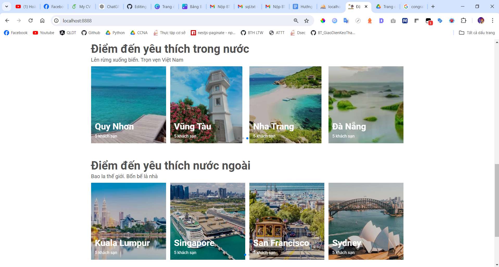

# Ivivu Holiday Website

This project is a web application for booking hotel rooms around the world. The website allows users to search for hotels, view room details, make reservations, and manage bookings.

## Table of Contents

-   [Introduction](#introduction)
-   [Features](#features)
-   [Technologies Used](#technologies-used)
-   [Installation](#installation)

## Introduction

The Ivivu Holiday Website is designed to provide a seamless and user-friendly experience for travelers looking to book hotel rooms online. The application supports multiple languages and currencies, catering to an international audience.

## Features

-   User Registration and Authentication
-   Hotel Search and Filtering
-   Room Details and Availability
-   Booking and Payment Integration
-   User Profile and Booking Management

## Technologies Used

-   **Frontend**: Bootstrap 5, Tailwind CSS, Thymeleaf, Google Maps Platform
-   **Backend**: Spring Boot
-   **Database**: MySQL

## Installation

1. Install VS Code or Intellij Idea
2. Download Xampp to your machine
3. Clone this repository or download the source code.
4. Open Xampp then start Apache and MySQL

    

5. Go to PhpMyAdmin to create a new database 'bigproject', then click to "Create"

    

6. Download link below to get your backup data:
   <a href="https://drive.google.com/file/d/1XJycbBoMW22g6jrRRCOMgcq0skPVQhJi/view?usp=sharing">https://drive.google.com/file/d/1XJycbBoMW22g6jrRRCOMgcq0skPVQhJi/view?usp=sharing</a>
7. Copy all the code and paste it into your database, then run by shorthand `Ctrl + Enter`

    

8. Open VS Code and go to path `src/main/java/t3h/bigproject/BigProjectApplication.java`, then click the triangle to start the project

    

9. Open your Browser and go to url <a href="http://localhost:8888">http://localhost:8888</a> to see your result. If your interface is this, I congratulate on you!

    

    
